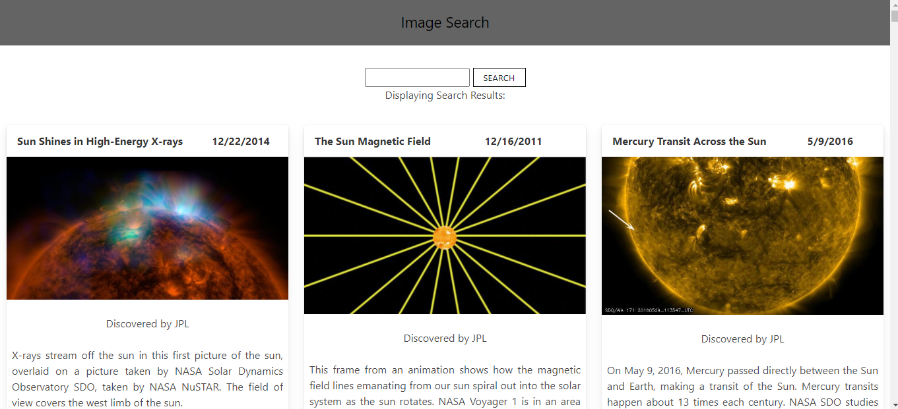

# NasaApi 

  ## Description
  * Search for a Nasa related topic to view images related to its
* An app using the Nasa Images and Video Library API (The Documentation can be found [here](https://images.nasa.gov/docs/images.nasa.gov_api_docs.pdf))
* Clicking an image opens that image in a new tab

  
  
  ## Table of Contents
  * [Technologies](#technologies)
  * [Usage](#usage)
  * [Contributing](#contributing)
  * [License](#license)
  
  ## Technologies

* This project is built using the following:
    * HTML
    * CSS
    * Javascript
    * React.js
    * Bulma

  ## Usage

* Visit the [Live Webpage](https://nasa-api-images.herokuapp.com/)

  ## App
  ### Webpage
  

  ## Contributing

  For contributions please open an issue or new pull request

  ## Test

  n/a
  
  ## Questions

  I can answer questions via email or through github

  * Github Profile: [Alec74](https://github.com/Alec74)
  * alecmcglone@gmail.com
  * LinkedIn Profile: [AlecM](https://www.linkedin.com/in/alec-mcglone-900904206/)
  
  ## License
  Notice: This application is licensed under MIT
  
  [License-Link](./LICENSE)